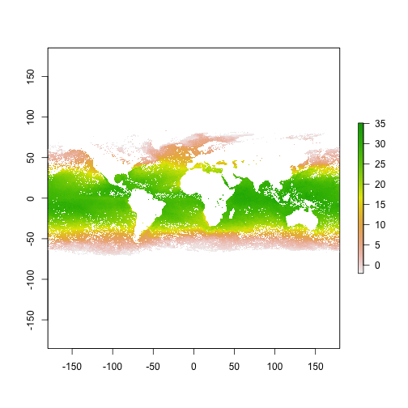

OceanColor Data Products and R
==============================

This is a quick analysis and demo for downloading and importing global oceancolor products (e.g SST, Chl-a) available from [NASA's OceanColor Web](http://oceancolor.gsfc.nass.gov) into R for mapping and analysis. The steps and tools described here are only guaranteed, at this point, to work within an OS X environment. That said, the tools used are available for other platforms and should be easily adapted.

### Required Software and Tools
* R 2.15.0
* GDAL 1.9 Complete frameworks available from [KyngChaos](http://www.kyngchaos.com/software/frameworks)
* rgdal 0.7.8-2 binary available from [KyngChaos](http://www.kyngchaos.com/software/frameworks)
* gdal programs must be available on the users path

### Load R Packages


```r
# if necessary uncomment and install packages.  install.packages('sp')
# install.packages('rgeos') install.packages('raster')
# install.packages('RCurl') install.packages('ggplot2')
library(sp)
library(rgdal)
library(rgeos)
library(raster)
library(RCurl)
library(ggplot2)
```


### Get 8-day composite SST (daytime 11$\mu$m) and unzip

First, we'll connect to the OceanColor website to download an example SST file. The [OceanColor Web](http://oceancolor.gsfc.nasa.gov) provides a web user interface for finding and downloading data from various MODIS and SeaWIFS satellite sensors. Users can find and download files into a single directory and the `OC2Raster` function (in development) will process all files within the directory. Files must be Level 3, SMI of HDF filetype.


```r
# eventually, we'll add the ability to specify date, data range and
# resolution
download.file("http://oceandata.sci.gsfc.nasa.gov/cgi/getfile/A20121212012128.L3m_8D_SST_4.bz2", 
    "A20121212012128.L3m_8D_SST_4.bz2")

cmd <- paste("bunzip2", "A20121212012128.L3m_8D_SST_4.bz2")
system(cmd)
```


Now that we have our file downloaded and unzipped, the first thing we need to do is create a GeoTIFF with the appropriate projection information. The OceanColor data are on a global Equidistant Cylindrical grid (specified by `EPSG:32662`). We also need to specify the 'no_data' value. This is typically `65535`, however, to be safe, we'll examine the metadata and extract the specified value. While at it, we'll also extract the slope and intercept values for the scaling equation.

#### Extract valuable metadata for this image

We need to extract the following values from the metadata:
* Westernmost Longitude (`min_lon`)
* Northernmost Latitude (`max_lat`)
* Easternmost Longitude (`max_lon`)
* Southernmost Latitude (`min_lat`)
* Map Projection (`map_proj`)
* Parameter (`param`)
* Period End Day (`day_end`)
* Period Start Day (`day_start`)
* Period End Year (`year_end`)
* Period Start Year (`year_start`)
* Suggested Image Scaling Applied (`scaled`)
* Scaling (`scaling`)
* Slope (`slope`)
* Intercept (`intercept`)

It should be easy enough to create our own function, `XtrMdata` to pull these values out from the metadata and return a named list


```r
XtrMdata <- function(gdal_obj) {
    require(rgdal)
    info <- GDALinfo(gdal_obj)
    attrs <- c("Westernmost Longitude=", "Northernmost Latitude=", "Easternmost Longitude=", 
        "Southernmost Latitude=", "Map Projection=", "Parameter=", "Period End Day=", 
        "Period Start Day=", "Period End Year=", "Period Start Year=", "Suggested Image Scaling Applied=", 
        "Scaling=", "Slope=", "Intercept=")
    var_names <- c("min_lon", "max_lat", "max_lon", "min_lat", "map_proj", "param", 
        "day_end", "day_start", "year_end", "year_start", "scaled", "scaling", 
        "slope", "intercept")
    i <- as.numeric(sapply(attrs, function(y) grep(y, attr(info, "mdata"))[1]))
    j <- sapply(i, function(y) unlist(strsplit(attr(info, "mdata")[y], "="))[2])
    j <- as.list(j)
    names(j) <- var_names
    return(j)
}
```


Now that we have our function, let's apply it to our downloaded OceanColor hdf


```r
mdata <- XtrMdata("A20121212012128.L3m_8D_SST_4")
# now, we'll convert to data.frame and transpose for pretty printing
mdata_t <- t(data.frame(mdata))
colnames(mdata_t) <- c("values")
mdata_t
```


```
##            values                   
## min_lon    "-180"                   
## max_lat    "90"                     
## max_lon    "180"                    
## min_lat    "-90"                    
## map_proj   "Equidistant Cylindrical"
## param      "Sea Surface Temperature"
## day_end    "128"                    
## day_start  "121"                    
## year_end   "2012"                   
## year_start "2012"                   
## scaled     "Yes"                    
## scaling    "linear"                 
## slope      "0.000717185"            
## intercept  "-2"                     
```


In order to translate the hdf file into a GeoTIFF, we have to make some assumptions:
1. The map projection is "Equidistant Cylindrical"
2. The extent of the grid is global
3. The values have been linearly scaled

So, let's check that these assumptions are met


```
## Equidistant Cylindrical .... TRUE
```


```
## Global Coverage .... TRUE
```


```
## Linear Scaling .... TRUE
```


Now that we have satisfied all of our assumptions, we're ready to have `gdal_translate` convert the file from hdf to GeoTIFF and assign the correct projection


```r
in_hdf <- "A20121212012128.L3m_8D_SST_4"
out_tiff <- "A20121212012128.L3m_8D_SST_4.tif"
cmd <- paste("gdal_translate -a_srs \"+init=epsg:32662\" -a_ullr -180 90 180 -90 -a_nodata 65535 HDF4_SDS:UKNOWN:\"", 
    in_hdf, "\":0 ", out_tiff, sep = "")
system(cmd)
```


Now, we can read the newly created GeoTIFF into R as a `RasterLayer` object from the `raster` package. The `raster` package is more efficient than reading in the readGDAL (rgdal package) because it does not read all of the values into memory until needed.


```r
sst_raster <- raster(out_tiff)
sst_raster
```


```
## class       : RasterLayer 
## dimensions  : 4320, 8640, 37324800  (nrow, ncol, ncell)
## resolution  : 0.04167, 0.04167  (x, y)
## extent      : -180, 180, -90, 90  (xmin, xmax, ymin, ymax)
## coord. ref. : +proj=eqc +lat_ts=0 +lat_0=0 +lon_0=0 +x_0=0 +y_0=0 +datum=WGS84 +units=m +no_defs +ellps=WGS84 +towgs84=0,0,0 
## values      : /Users/josh.london/Arr/scratch/A20121212012128.L3m_8D_SST_4.tif 
## min value   : 0 
## max value   : 65535 
## layer name  : A20121212012128.L3m_8D_SST_4 
## 
```


If we examine the data values stored within the `RasterLayer`, we'll notice that reported values are not reasonable for expected SST in degrees Celcius ... in fact, the values are more appropriate for SST on Mercury. This is because the values have been linearly scaled to fit with the limits of the unsigned 16-bit integer. The scaling is a linear equation with slope and intercept values stored  as metadata in the original HDF. We've previously extracted the values and stored them as `slope` (=`0.000717185`) and `intercept` (=`-2`). 

First, here's the summary output for `sst_raster`. Note, the `getValues` function is used to retrieve the values for the `RasterLayer` since, by default, the values are not read into memory.


```r
summary(getValues(sst_raster))
```


```
##     Min.  1st Qu.   Median     Mean  3rd Qu.     Max.     NA's 
##        0    11700    30900    26500    40200    52500 18876446 
```


Next, we'll apply our linear scaling equation to all the scaled values and use the `setValues` function to replace with the corresponding SST values.


```r
sst_raster <- setValues(sst_raster, as.numeric(mdata$slope) * getValues(sst_raster) + 
    as.numeric(mdata$intercept))
```


And, a plot of the raster


```r
plot(sst_raster)
```

 


